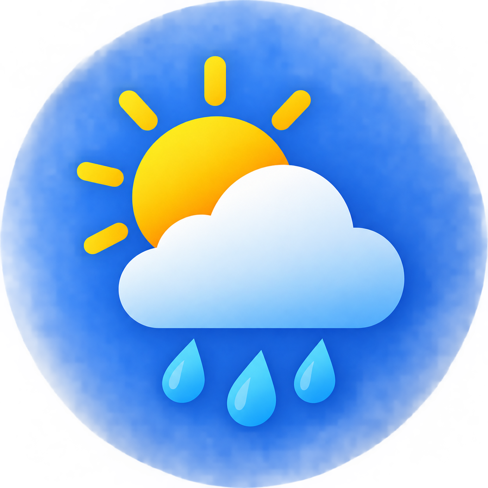

# Weather App

A simple, responsive weather app that lets you search for any city and instantly see its current temperature and weather conditions. Built with vanilla JavaScript and styled with Bootstrap.



## Features

- 🔍 Search current weather by city name
- 🌡️ Displays temperature in Celsius
- ☁️ Shows current weather condition (e.g. Clear, Rain, Clouds)
- 💻 Clean, responsive card-based UI with hover effects
- ⚡ Powered by the OpenWeatherMap API

## Tech Stack

- **HTML5** — structure
- **CSS3** — custom styling
- **Bootstrap 5.3.8** — layout and UI components
- **Remix Icon** — icon set
- **Vanilla JavaScript** — API calls and DOM manipulation
- **OpenWeatherMap API** — weather data

## Project Structure

```
├── index.html      # Main HTML page
├── style.css       # Custom styles
├── script.js       # Weather fetching logic
└── assets/
    ├── weather-img.png   # Header icon
    └── bg-img.png        # Background image
```

## Getting Started

### Prerequisites

- A modern web browser
- An [OpenWeatherMap API key](https://openweathermap.org/api) (free tier available)

### Setup

1. Clone or download this repository.
2. Open `script.js` and replace the `apiKey` value with your own OpenWeatherMap API key:
   ```js
   const apiKey = "YOUR_API_KEY_HERE";
   ```
3. Make sure the `assets/` folder contains `weather-img.png` and `bg-img.png`.
4. Open `index.html` in your browser — no build step or server required.

## Usage

1. Type a city name into the input field.
2. Click **Search**.
3. The current temperature (°C) and weather condition will be displayed below the input.
